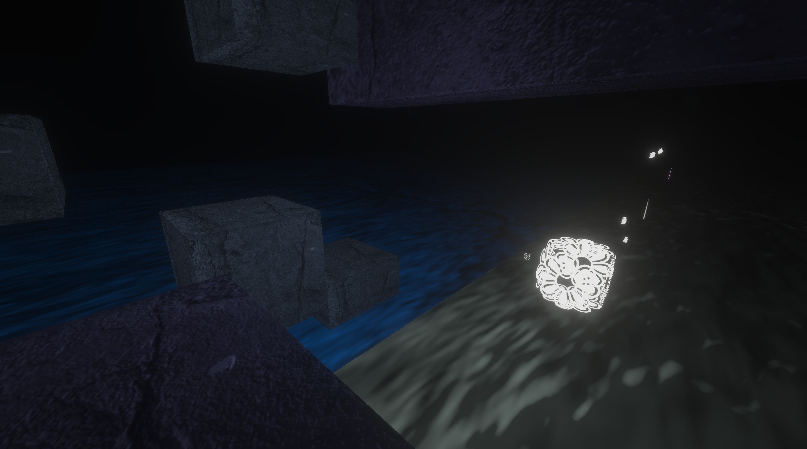
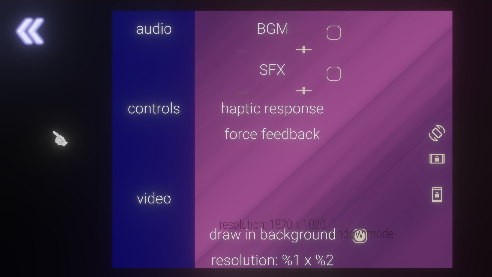

# Portfolio

*C++, SDL2 (later SDL3), OpenGL*

Video capture of an early prototype platform game I made using OpenGL:

Turned into this using Bullet to simplify the 3D calculations and movement:

Rough menu for functionality, which also allows custom themes through JSON:

